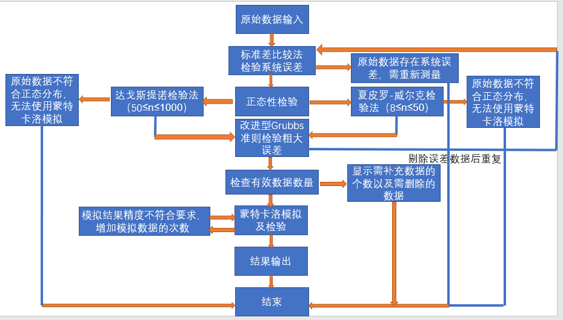

# 水利定额计算器
具有定额计算功能，实际上是一个正太分布数据模拟器+pyqt 的GUI壳子
具体的数据处理流程见下图

技术点：
- pyqt各个简单组件的使用和信号与槽的连接
- 为防止gui假死需要为文件读写和耗费时间的计算等开多进程（继承QThread）
- python统计学函数库
- 文件读写

bug点：
- 历史记录不能实时更新：实时更新需要耗时太长会导致界面假死，但是如果定义进程处理类又不能获取Ui组件，暂时不知道怎么处理
- 组件皆为绝对定位，分辨率不同的设备不能兼容